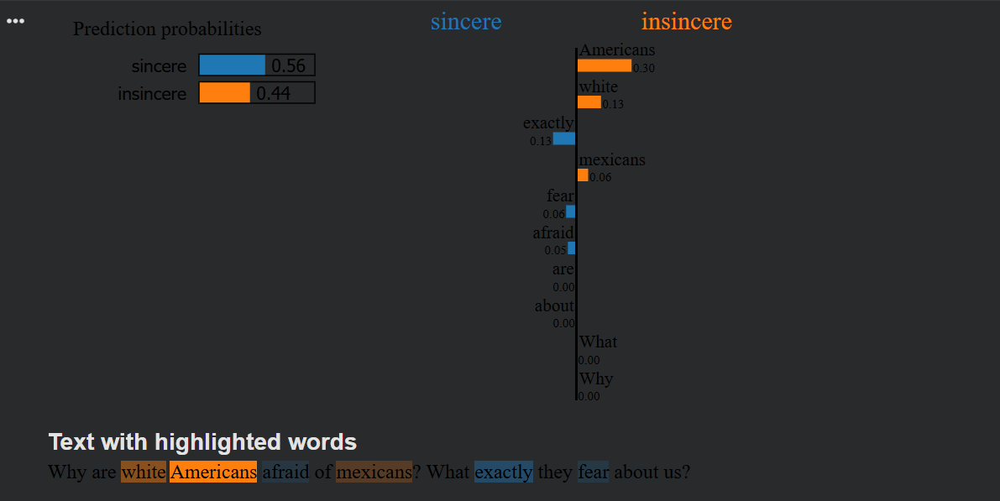

# Quora Insincere Questions — Explained with LIME

A text classification project that flags insincere (toxic/trolling) questions from Quora, and uses LIME to explain *why* the model made each prediction — not just what it predicted.

## Problem

Quora has millions of questions, and a small percentage of them are "insincere" — asked in bad faith, to make a statement rather than actually get an answer, or to attack a group of people. A model that just labels a question "insincere" without explaining why isn't very trustworthy or useful for a moderator trying to review it. So this project does two things: builds a working classifier, and then uses **LIME (Local Interpretable Model-agnostic Explanations)** to show which words actually caused each prediction.

## Dataset

[Quora Insincere Questions Classification](https://www.kaggle.com/competitions/quora-insincere-questions-classification) — ~1.3M labeled questions, with a binary `target` (0 = sincere, 1 = insincere). This project trains on a subset of ~143K rows.

To reproduce: download `train.csv` from the Kaggle competition page and place it at `data/train.csv` relative to the notebook (see `data/README.md`).

## Approach

1. **Preprocessing** — dropped rows with missing `target` or `question_text`, then split into train/validation sets (90/10).
2. **Vectorization** — `TfidfVectorizer` (unigrams + bigrams, English stop words removed, top 100K features by frequency).
3. **Model** — `LogisticRegression` (C=0.5, `sag` solver) trained on the TF-IDF vectors.
4. **Explainability** — `LimeTextExplainer` perturbs the input text (removing/swapping words) and fits a local surrogate model to approximate how the classifier behaves around that specific prediction, surfacing which words pushed it toward "sincere" or "insincere."

**Why Logistic Regression?** The main goal of this project was learning LIME, not squeezing out the highest accuracy. Logistic Regression on TF-IDF is fast to train, easy to reason about, and LIME's explanations are easier to sanity-check on a simple model before trying it on something more complex like a neural network.

## How to run

1. Clone this repo and `cd` into this folder.
2. Install dependencies: `pip install -r requirements.txt`
3. Download `train.csv` from the [Kaggle competition page](https://www.kaggle.com/competitions/quora-insincere-questions-classification) and place it at `data/train.csv` (see `data/README.md` for details).
4. Open `quora_insincere_lime.ipynb` in Jupyter or Colab and run the cells in order.

## Results

Evaluated on the held-out validation set (14,347 questions):

| Metric | Score |
|---|---|
| Accuracy | 0.945 |
| Precision (insincere) | 0.707 |
| Recall (insincere) | 0.214 |
| F1 Score (insincere) | 0.329 |

**Confusion matrix:**

| | Predicted sincere | Predicted insincere |
|---|---|---|
| **Actual sincere** | 13,367 | 80 |
| **Actual insincere** | 707 | 193 |

**Being honest about these numbers:** 94.5% accuracy sounds great, but it's misleading here. Only about 900 of the 14,347 validation questions are actually insincere, so a model could get high accuracy just by predicting "sincere" most of the time. The more useful numbers are precision and recall on the insincere class: when the model does flag something as insincere, it's right 71% of the time (precision), but it only catches 21% of all the actual insincere questions (recall). So the model is cautious rather than good — it misses most of the insincere questions. This is a class imbalance problem, and fixing it (class weights, oversampling, etc.) would likely help a lot.

## Explainability walkthrough

For the validation question *"Why are white Americans afraid of Mexicans? What exactly they fear about us?"* (true label: insincere), the model predicted a 43.5% probability of being insincere.

LIME's word-level attribution showed the words pushing the prediction toward "insincere" were **"Americans"** and **"white"** (the two strongest positive contributors), while words like "exactly," "fear," and "afraid" pulled slightly toward "sincere."

*(Bar chart of word weights — generated by the notebook, showing which words pushed the prediction toward "insincere" vs "sincere".)*

To check if LIME's explanation was actually correct, I zeroed out the TF-IDF weights for "Americans" and "white" and re-ran the prediction. The insincere probability dropped from 0.435 to 0.057 — a difference of -0.378. This confirms the model really was relying on those two words, not just that LIME picked words that looked convincing.

**A note on LIME's limits:** LIME only explains one prediction at a time — it doesn't tell you how the model behaves overall. It also works by randomly changing the input text a bit and seeing how the prediction changes, so running it twice on the same question can give slightly different word weights. It's useful for checking individual predictions, but it's not a full picture of the model.

## Requirements

See `requirements.txt`. Core libraries: `pandas`, `scikit-learn`, `lime`, `matplotlib`, `seaborn`.

## Credits

Dataset from the [Kaggle Quora Insincere Questions Classification competition](https://www.kaggle.com/competitions/quora-insincere-questions-classification). Explainability via the [LIME](https://github.com/marcotcr/lime) library (Ribeiro et al.).
