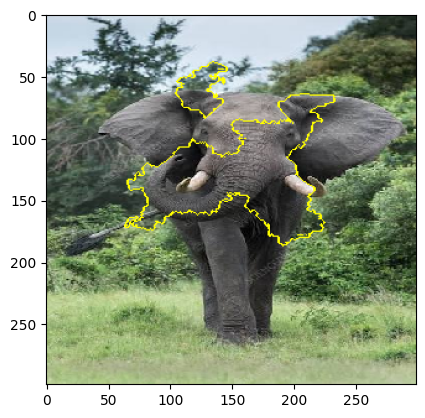

# InceptionV3 Image Classification + LIME Explainability

Using a pretrained InceptionV3 model to classify images, then applying LIME to understand *why* it made that prediction — which regions of the image actually drove the decision.

## Why this project

Project 01 in this repo applied LIME to a text classifier (Quora Insincere Questions). This project applies the same idea — "explain a black-box model's prediction" — to images instead, using superpixel-based perturbation to see which parts of an image the model actually paid attention to.

## Example

The yellow outlines mark the superpixel regions LIME identified as most influential in the model's top prediction — in this case, the face, ears, and tusks.

## What it does

1. Loads InceptionV3, pretrained on ImageNet (1000 classes) — no training involved, used directly for inference.
2. Preprocesses an uploaded image into the exact format InceptionV3 expects (299×299, batched, normalized).
3. Runs a prediction and shows the top-5 ImageNet class guesses with confidence scores.
4. Uses LIME (`lime_image.LimeImageExplainer`) to perturb the image into superpixel regions and observe how the model's prediction shifts — building a local, interpretable approximation of the model's behavior around that specific image.
5. Visualizes the explanation four different ways:
   - Top contributing region only, rest of the image hidden
   - Top contributing regions, with the rest of the image visible
   - Positive *and* negative contributing regions together
   - A weighted threshold view (`min_weight=0.035`) showing only regions above a certain influence

## Performance note

Running `explain_instance` with `num_samples=1000` means the model gets called 1000 times (once per perturbed sample) — this took **6–7 minutes on CPU**. Switching to a Colab T4 GPU runtime brought it down to **~35 seconds**. This turned out to be the most useful practical lesson from the project: LIME's cost isn't the explanation math, it's the sheer number of forward passes through the underlying model.

## Tech stack

Python, TensorFlow/Keras, InceptionV3 (pretrained on ImageNet), LIME, scikit-image, matplotlib, NumPy

## Next step

Planning to wrap this pipeline in a Gradio interface so anyone can upload an image and see the prediction + all four LIME visualizations directly, without running the notebook. Not yet built/tested — will update this README once it's live.

## Credits

- [LIME](https://github.com/marcotcr/lime) — Ribeiro, M. T., Singh, S., & Guestrin, C. (2016). "Why should I trust you?": Explaining the predictions of any classifier.
- InceptionV3 — pretrained weights via Keras Applications, trained on ImageNet.
