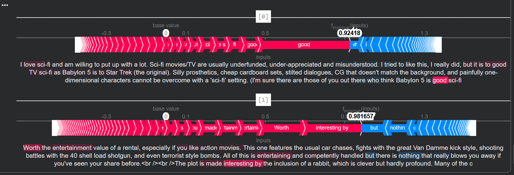

# 04 — SHAP for Text Data: Explaining a Sentiment Classifier

## What this project does

I took a **pretrained sentiment analysis model** (not one I trained myself) and used **SHAP** to explain *why* it labels a movie review as POSITIVE or NEGATIVE — down to which individual words pushed the prediction in each direction.

The goal wasn't to build the best sentiment classifier. It was to understand how SHAP works on **text data**, which behaves very differently from tabular or image data — here, the "features" are words/tokens, and their number changes from one input to the next.

## Dataset

- **IMDb movie reviews** (`stanfordnlp/imdb` from HuggingFace Datasets), test split.
- Used only the **first 20 reviews**, and truncated each to its **first 500 characters** — just enough to keep things fast and manageable in Colab, not meant to be a serious benchmark.

## Model

- Used HuggingFace's `transformers.pipeline("sentiment-analysis")` **off the shelf** — no fine-tuning.
- This defaults to `distilbert-base-uncased-finetuned-sst-2-english`.
- On the 20-review sample, it got **90% accuracy** against the true IMDb labels. (Small sample — this is a sanity check, not a real evaluation.)

## How the SHAP explanation was generated

This is the core of the project — the actual explainer setup:

```python
import shap
import transformers

# 1. Load the pretrained sentiment-analysis pipeline
classifier = transformers.pipeline("sentiment-analysis", return_all_scores=True)

# 2. Create a SHAP explainer directly from the pipeline.
#    SHAP auto-detects it's a text pipeline and uses its Partition explainer,
#    which works by splitting/masking chunks of text and observing how the
#    prediction changes.
explainer = shap.Explainer(classifier)

# 3. Generate SHAP values for the first 2 reviews
shap_values = explainer(short_data[:2])

# shap_values.shape -> (2, None, 2)
#   2   = number of reviews explained
#   None = variable number of tokens per review (text length isn't fixed)
#   2   = number of output classes (NEGATIVE, POSITIVE)

# 4. Visualize word-level contributions toward the POSITIVE class

shap.plots.text(shap_values[:, :, "POSITIVE"])
```

**What `shap.plots.text` actually shows:** each word in the review is highlighted — red words pushed the prediction *toward* POSITIVE, blue words pushSed it *toward* NEGATIVE. The intensity of the color shows how strong that word's influence was. Hovering/clicking on a word (in the notebook) reveals its exact contribution value.

## Plot



## What I learned / observations

- SHAP for text uses a **different explainer strategy (Partition)** than tabular/image SHAP — it works by masking contiguous spans of text and measuring how the model's output shifts, rather than perturbing individual pixels or features.
- Because review length varies, the SHAP values array has a variable middle dimension (`None`) — this tripped me up at first since I expected a fixed shape like tabular SHAP outputs.
- Explaining even 2 reviews produces a lot of output — this doesn't scale well to explaining an entire dataset in one shot; it's meant for inspecting individual predictions.

## Limitations / what I'd do differently

- Only evaluated on 20 reviews and explained 2 — too small to draw any real conclusions about the model, this was purely about learning the SHAP text workflow.
- Reviews were hard-truncated to 500 characters, which can cut off context mid-sentence and may affect both predictions and explanations.
- Used the pipeline's **default model** without checking if it's actually a good fit for IMDb-style long-form reviews (it's trained on SST-2, which is shorter, single-sentence movie review snippets).

## How to run

```bash
pip install -U datasets transformers shap
```

Then run the notebook `Shap_for_text_data.ipynb` (inside `04-SHAP_Text_Sentiment_Explainability/`) top to bottom in Colab (T4 GPU recommended for the transformer pipeline, though not strictly required for this dataset size).

## References / credit

- [SHAP documentation](https://shap.readthedocs.io/)
- [HuggingFace Transformers `pipeline`](https://huggingface.co/docs/transformers/main_classes/pipelines)
- [IMDb dataset (stanfordnlp/imdb)](https://huggingface.co/datasets/stanfordnlp/imdb)
