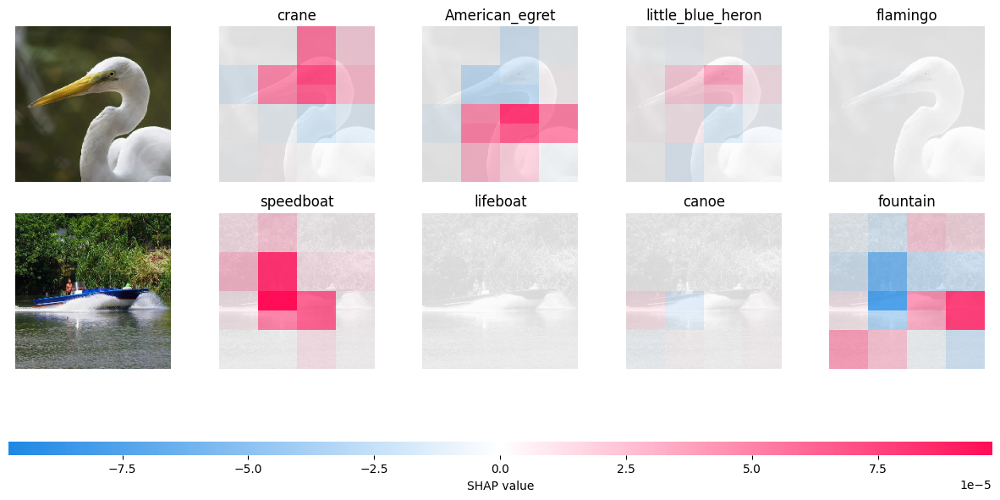
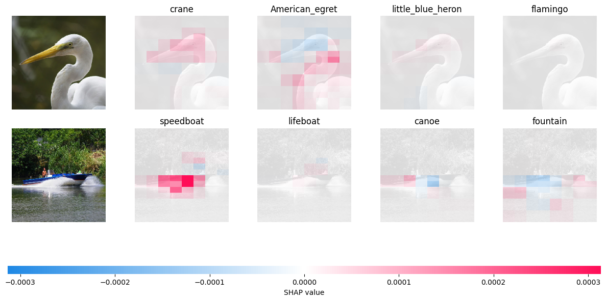

# 05 — SHAP for Image Data: Explaining a ResNet50 Classifier

## What this project does

I took a **pretrained ResNet50 model** (trained on ImageNet, not fine-tuned by me) and used **SHAP** to explain *which parts of an image* the model relied on to make its top predictions. Unlike the text project, here the "features" are patches/pixels of an image, and the explanation is a heatmap overlaid on the original image instead of highlighted words.

I also compared **two different masking strategies** SHAP offers for images, to see how the choice of masker changes both the explanation and how long it takes to compute.

## Dataset

- `shap.datasets.imagenet50()` — a small built-in SHAP dataset of 50 sample ImageNet images, shape `(50, 224, 224, 3)`.
- Pixel values were clipped and cast to `uint8` (0–255 range) before use, since the raw array wasn't guaranteed to be in that range.
- Only images at index `[1:3]` (2 images) were actually explained — this is a walkthrough of the SHAP-for-images workflow, not a full evaluation.

## Model

- **ResNet50**, loaded with pretrained ImageNet weights (`tensorflow.keras.applications.resnet50.ResNet50(weights='imagenet')`).
- No training or fine-tuning — used purely as a black box to explain.
- Class names (1000 ImageNet categories) pulled from Keras' hosted `imagenet_class_index.json`.

## How the SHAP explanation was generated

This is the core setup — done twice, once per masker:

```python
from tensorflow.keras.applications.resnet50 import preprocess_input
import shap

# Wrap the model so SHAP can call it directly on raw pixel batches.
# preprocess_input applies ResNet50's expected normalization before inference.
def f(x):
    tmp = x.copy()
    preprocess_input(tmp)
    return model(tmp)

# --- Masker 1: inpainting ---
# Masks out (hides) parts of the image by inpainting them, rather than just
# blacking them out — this avoids introducing "fake edges" that could bias
# the explanation.
masker = shap.maskers.Image('inpaint_telea', X[0].shape)
explainer = shap.Explainer(f, masker, output_names=class_names)

# Explain 2 images, using 100 model evaluations per image to estimate SHAP
# values, and only look at the model's top-4 predicted classes per image.
shap_values = explainer(
    X[1:3],
    max_evals=100,
    batch_size=50,
    outputs=shap.Explanation.argsort.flip[:4]
)

shap.image_plot(shap_values)
```

```python
# --- Masker 2: Gaussian blur ---
# Masks out parts of the image by blurring them instead of inpainting.
masker = shap.maskers.Image('blur(128,128)', X[0].shape)
explainer = shap.Explainer(f, masker, output_names=class_names)

# Same 2 images, but with more evaluations (500 vs 100) for a finer-grained
# explanation — blur masking needed more evaluations to get a stable result.
shap_values = explainer(
    X[1:3],
    max_evals=500,
    batch_size=50,
    outputs=shap.Explanation.argsort.flip[:4]
)

shap.image_plot(shap_values)
```

**What `shap.image_plot` shows:** for each input image, it displays a row of heatmaps — one per top predicted class. Red regions are pixels that pushed the prediction *toward* that class; blue regions pushed *away* from it. This makes it visually obvious which part of the image (e.g., the animal's face vs. the background) the model actually "looked at."

## Plot

*(Screenshots of the `shap.image_plot` output — top row from the inpainting masker, bottom row from the blur masker.)*





## What I learned / observations

- SHAP for images works by **masking spatial regions** and observing the change in prediction — conceptually similar to the text explainer (which masks spans of words), just applied to pixels instead.
- The **choice of masker matters**: `inpaint_telea` fills masked regions with a plausible reconstruction (avoids sharp, unnatural edges that could confuse the model), while `blur` just smudges that region out. Different maskers can shift both the resulting explanation and the computation cost.
- The blur masker needed **5x more evaluations** (500 vs. 100) in this run to get a usable explanation — masking strategy directly affects how many samples SHAP needs to converge on a stable estimate.
- `outputs=shap.Explanation.argsort.flip[:4]` limits the explanation to only the model's **top 4 predicted classes** per image, instead of all 1000 — this keeps the plot readable and the computation fast.

## Limitations / what I'd do differently

- Only explained 2 images out of the 50 available — enough to see the workflow, not enough to draw conclusions about the model's general behavior.
- Didn't do a rigorous side-by-side comparison of the two maskers (e.g., timing them, or checking if they agree on which pixels matter) — just ran both and eyeballed the plots.
- Used ResNet50 as a black box with default ImageNet weights — no attempt to explain a custom-trained model, which is a more realistic use case for XAI.

## How to run

```bash
pip install shap tensorflow
```

Then run the notebook `imagenet_shap.ipynb` (inside `05-SHAP_Image_ResNet50_Explainability/`) top to bottom. A GPU speeds up the SHAP evaluations but isn't required for just 2 images.

## References / credit

- [SHAP documentation](https://shap.readthedocs.io/)
- [SHAP Image Explainer examples](https://shap.readthedocs.io/en/latest/image_examples.html)
- [Keras ResNet50 application](https://keras.io/api/applications/resnet/)
- [ImageNet](https://www.image-net.org/)
