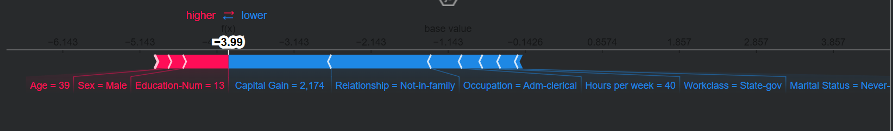
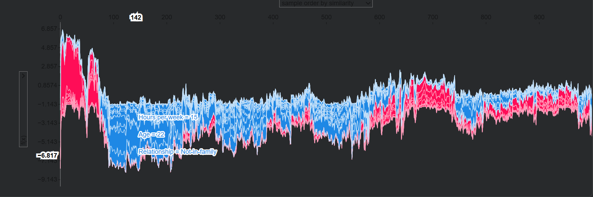
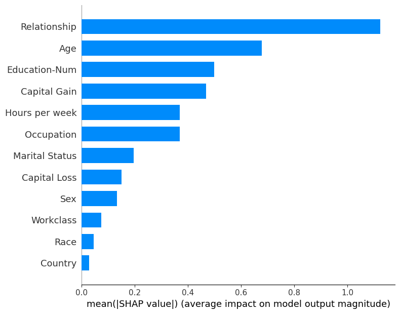
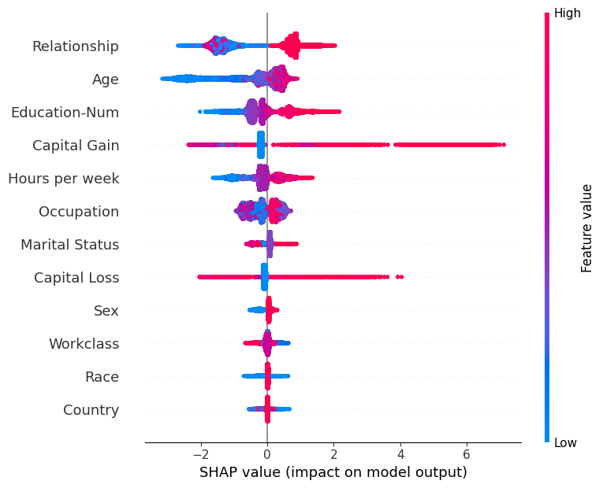
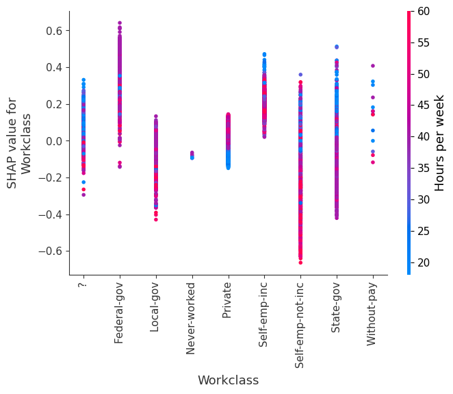

# 06 — SHAP for Tabular Data: Explaining an XGBoost Income Classifier

## What this project does

I trained an **XGBoost model** to predict whether a person earns more than $50K/year based on census data (the classic "Adult Income" dataset), then used **SHAP's `TreeExplainer`** to explain the model's predictions — both for individual people and across the whole dataset.

This is different from the text and image projects in one important way: since XGBoost is a **tree-based model**, SHAP can use `TreeExplainer`, which is exact and much faster than the general-purpose `Explainer` used for the text/image pipelines (no sampling/approximation needed).

## Dataset

- **Adult Census Income dataset**, loaded directly via `shap.datasets.adult()`.
- 32,561 rows, 12 features (age, workclass, education, marital status, occupation, relationship, race, sex, capital gain/loss, hours-per-week, native country).
- Target: whether income is `>50K` (binary).
- Loaded two versions: a numeric-encoded version (`X`, `y`) for training, and a human-readable display version (`X_display`, `y_display`) for showing actual category names (e.g. "Private", "Married-civ-spouse") in plots instead of encoded numbers.
- Split 80/20 into train/test (`random_state=7`).

## Model

- **XGBoost** (`binary:logistic` objective), trained with:
  - `eta=0.01` (learning rate), `subsample=0.5`
  - `base_score` set to the mean of the training labels
  - Up to 5000 boosting rounds, with **early stopping** after 20 rounds of no improvement on the test set (it stopped around round ~1208)
- **Test accuracy: 87.53%**
- Also checked XGBoost's own built-in feature importance (`weight`, `cover`, and `gain` types) before bringing in SHAP — useful as a sanity check to compare against SHAP's explanations later.

## How the SHAP explanation was generated

```python
import shap

# TreeExplainer is purpose-built for tree-based models (XGBoost, LightGBM,
# Random Forest, etc.) — it computes exact SHAP values efficiently using the
# tree structure itself, instead of approximating via sampling.
explainer = shap.TreeExplainer(model)

# Compute SHAP values for every row in the dataset
shap_values = explainer.shap_values(X)
```

From here, three different plot types were used to look at the explanations from different angles:

### 1. Force plot — explaining a single prediction

```python
shap.initjs()  # needed to render the interactive JS plot in the notebook

shap.force_plot(
    explainer.expected_value,   # the model's average prediction (baseline)
    shap_values[0, :],          # SHAP values for the first person in the dataset
    X_display.iloc[0, :]        # their actual feature values, human-readable
)
```
Shows, for **one person**, which features pushed their predicted income up (red) or down (blue) relative to the average prediction.

```python
# Same idea, but stacked for the first 1000 people — gives a
# "which features matter across many people at once" view
shap.force_plot(
    explainer.expected_value, shap_values[:1000, :], X_display.iloc[:1000, :]
)
```

### 2. Summary plot — global feature importance

```python
# Bar version: average impact of each feature, ranked
shap.summary_plot(shap_values, X_display, plot_type='bar')

# Beeswarm version: shows impact AND direction (does a high/low value
# push the prediction up or down) for every feature, across all rows
shap.summary_plot(shap_values, X)
```

### 3. Dependence plots — how one feature's value relates to its impact

```python
# One plot per feature: shows how that feature's actual value relates to
# its SHAP value (impact on prediction), and automatically picks another
# feature to color by (to reveal interaction effects)
for name in X_train.columns:
    shap.dependence_plot(name, shap_values, X, display_features=X_display)
```

## Plots

*(Screenshots — pick the most informative ones rather than pasting all 12 dependence plots.)*

**Force plot (single prediction):**


**Force plot (first 1000 people):**


**Summary plot (bar — global importance):**


**Summary plot (beeswarm — impact and direction):**


**Dependence plot (most interesting feature, e.g. Age or Capital Gain):**


## What I learned / observations

- `TreeExplainer` is a completely different mechanism from the `Explainer`/Partition approach used for text and images — it exploits the tree structure to compute **exact** SHAP values instead of estimating them through repeated masking, which is why it can run on the full 32,561-row dataset without needing to sample.
- The **force plot** is best for explaining one (or a handful of) predictions — good for "why did the model predict this for this person" type questions.
- The **summary plot** (especially the beeswarm version) is the best single view for understanding what the model relies on *overall* — not just which features matter, but whether high or low values of that feature push predictions up or down.
- The **dependence plot** revealed non-linear relationships that a single importance number wouldn't show — e.g., a feature's impact isn't necessarily proportional to its raw value across the whole range.
- Comparing SHAP's summary plot against XGBoost's built-in `plot_importance` (weight/cover/gain) was useful — they don't always agree on ranking, since XGBoost's built-in metrics are about how often/how usefully a feature is used for splits, while SHAP measures actual impact on individual predictions.

## Limitations / what I'd do differently

- Didn't dig into *why* SHAP's importance ranking differs from XGBoost's built-in importance metrics — would be worth a proper comparison.
- Generated a dependence plot for every single feature in a loop — fine for exploration, but for the README/portfolio I only kept the most interesting one(s); worth being more selective next time about what's actually shown.
- The dataset itself has known fairness concerns (it encodes race, sex, marital status directly) — SHAP is showing that the model does rely on some of these; I haven't done any fairness/bias analysis here, just explainability.
- No hyperparameter tuning beyond the defaults used — the 87.53% accuracy is a reasonable baseline, not an optimized result.

## How to run

```bash
pip install shap xgboost plotly
```

Then run the notebook `adult_income_shap.ipynb` (inside `06-SHAP_Tabular_Adult_Income/`) top to bottom. No GPU needed — XGBoost training here is CPU-friendly and fast.

## References / credit

- [SHAP documentation](https://shap.readthedocs.io/)
- [SHAP TreeExplainer](https://shap.readthedocs.io/en/latest/generated/shap.TreeExplainer.html)
- [XGBoost documentation](https://xgboost.readthedocs.io/)
- [Adult Census Income dataset (UCI)](https://archive.ics.uci.edu/dataset/2/adult)
